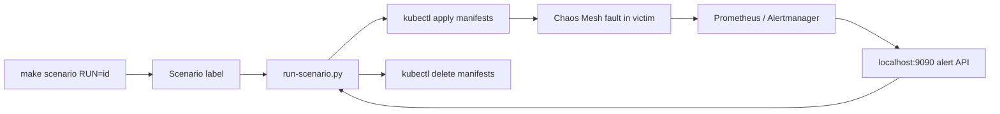

# Incident Response Mesh: End-to-End Learning Lab

## Learning goal and assumptions

By the end of this lab, you should be able to trace one scenario from its YAML
label through Kubernetes fault injection, alert checking, and cleanup; identify
which files define behaviour versus expectations; and predict why a run passes
or fails.

This assumes you can read YAML and have a basic idea of Kubernetes resources.
You do not need prior Chaos Mesh, Prometheus, or Python experience. This is a
guide to the **current implementation**, not a claim that every scenario is
live-verified in a cluster.

## Why this repository exists

Incident Response Mesh is a local incident-training environment. It packages:

- a deliberately constrained victim application;
- monitoring and an alert receiver;
- Chaos Mesh faults; and
- a catalog of labelled scenarios that an automated runner can execute.

The useful loop is: create a known failure, observe signals, compare them with
the scenario's expected ground truth, then remove the failure. That makes an
incident hypothesis reproducible rather than purely narrative.

## Background: the layers of the implementation

The [Makefile](Makefile) is the operator's front door. It creates a local k3d
cluster, deploys the victim app, installs monitoring, installs Chaos Mesh, and
exposes `make scenario RUN=<id>`.

The infrastructure is declarative:

1. [infra/cluster/k3d.yaml](infra/cluster/k3d.yaml) defines a one-server,
   two-agent local cluster and host port mappings.
2. [infra/victim/values-local.yaml](infra/victim/values-local.yaml) configures
   the OpenTelemetry demo as the victim workload.
3. [infra/monitoring/values-local.yaml](infra/monitoring/values-local.yaml)
   configures the Prometheus stack, alert rules, and Alertmanager delivery to
   [alert-echo](infra/monitoring/alert-echo.yaml).
4. [infra/chaos/values-local.yaml](infra/chaos/values-local.yaml) configures
   Chaos Mesh for local use.

The scenario system adds two kinds of YAML:

- A file under [scenarios/labels](scenarios/labels) is a *training contract*:
  root cause, expected severity, expected alerts, red herrings, remediation
  ideas, and the manifest paths to run.
- A file under [scenarios/manifests](scenarios/manifests) is an *executable
  Kubernetes/Chaos Mesh resource* that introduces the disruption.

The contract is validated by [scenarios/schema.py](scenarios/schema.py) and
[scenarios/validate.py](scenarios/validate.py). It is executed by
[scripts/run-scenario.py](scripts/run-scenario.py).

## Intuition first: an incident flight simulator

Think of the project as a flight simulator, not a production incident system.
The label is the instructor's exercise card; the manifest is the control that
creates turbulence; Prometheus and Alertmanager are the instruments; and the
runner is the instructor who starts the exercise, waits, checks the instruments,
then resets the simulator.



Where the analogy breaks: a label does not cause a failure, and an alert name in
a label does not create an alert rule. Each is separately configured. Kubernetes
scheduling, scrape timing, and Helm chart behaviour also make this a real
distributed system rather than a deterministic board game.

## Formal model: what a scenario means

The Pydantic ScenarioLabel model has this useful shorthand:

[
S = (id, category, manifests, root_cause, severity, expected, red_herrings,
remediations, duration, notes)
]

The schema constrains category to infra, network, app, or compound; severity to
critical or warning; and requires the other core fields. The tests in
[tests/test_scenarios_schema.py](tests/test_scenarios_schema.py) protect that
data contract.

For a loaded scenario, the runner's execution model is:

[
apply(M_1...M_n) 
ightarrow wait(duration) 
ightarrow query(alerts)

ightarrow cleanup(M_1...M_n)
]

An important implementation detail is the current alert predicate:

[
pass = expected subseteq firing_alerts land red_herrings subseteq firing_alerts
]

So red_herring_signals are not merely tolerated extra signals: the current
runner requires every named one to be firing. See check_alerts() in
[scripts/run-scenario.py](scripts/run-scenario.py). This may differ from how you
would design a future scoring system.

## Worked example: network-api-latency

Open [the label](scenarios/labels/network-api-latency.yaml). It says that the
root cause is high checkout latency, points to one executable manifest, waits
60 seconds, and expects CheckoutServiceHighLatency at warning severity.

Now open [the manifest](scenarios/manifests/network-api-latency.yaml). It is a
Chaos Mesh NetworkChaos resource aimed at the checkout workload and introduces
a 500 ms network delay for 90 seconds. The different durations are intentional
data you must reason about: the runner waits for the label's 60 seconds before
checking, while the fault resource itself has its own lifecycle.

Run the conceptual trace:

1. `make scenario RUN=network-api-latency` invokes the Python runner.
2. The runner loads and validates the label with ScenarioLabel.
3. It applies the referenced manifest with kubectl apply -f.
4. It sleeps for duration_seconds.
5. It asks Alertmanager's local API at http://localhost:9090/api/v1/alerts.
6. It succeeds only if the required alert sets are present, then deletes the
   manifest even after a failed alert check.

This shows the boundary between intent and proof. A syntactically valid label
and manifest do not prove that the named alert will fire in a live cluster. The
monitoring rules, target selection, port-forward/API availability, and timing
must line up too.

## Microworld 1: predict the runner's alert decision

Before reading the result, predict the return value for each call. Change the
three sets and rerun this tiny model in a Python REPL.

```python
def scenario_passes(expected, red_herrings, firing):
    return expected <= firing and red_herrings <= firing

expected = {"CheckoutServiceHighLatency"}
red_herrings = set()

for firing in [
    {"CheckoutServiceHighLatency"},
    {"TargetDown"},
    {"CheckoutServiceHighLatency", "TargetDown"},
]:
    print(sorted(firing), "=>", scenario_passes(expected, red_herrings, firing))
```

<details>
<summary>Reveal</summary>

The first and third cases pass; the second fails. Additional firing alerts do
not fail the run. Only missing required alerts do.

Perturbation: set red_herrings = {"TargetDown"}. Now the first case fails and
only the third passes. That is the exact surprising behaviour of the current
implementation.
</details>

## Microworld 2: predict cleanup after a partial apply failure

Imagine a label references two manifests, A then B.

- kubectl apply A succeeds.
- kubectl apply B fails because its resource is invalid.

What should still exist when the command returns?

<details>
<summary>Reveal</summary>

The runner deletes the manifests it had already applied before returning failure,
so A should be cleaned up. B was never successfully created. This is why the
runner records successfully applied paths and has cleanup logic on the apply
failure path, rather than only at the happy-path end.

Perturbation: if the process is forcibly terminated before cleanup, Kubernetes
resources can remain. The script improves normal-path hygiene; it is not a
transaction manager.
</details>

## Other execution paths worth knowing

- `make chaos RUN=<experiment>` uses
  [scripts/run-chaos.sh](scripts/run-chaos.sh) for the five foundational
  experiments in [chaos/experiments](chaos/experiments). It is simpler than the
  scenario runner: apply, wait based on YAML duration parsing, delete.
- `make smoke-test` runs [scripts/smoke-test.sh](scripts/smoke-test.sh),
  which checks the frontend, a Jaeger trace query, failure after scaling a
  component down, and recovery after scaling it back.
- scripts/generate-alert-fixtures.sh deliberately creates a bad image state,
  captures alert receiver logs, then restores the deployment. It is a fixture
  generator, not the scenario runner.
- [tests/test_run_scenario.py](tests/test_run_scenario.py) mocks commands and
  alert API responses. These tests verify runner logic without claiming a k3d
  cluster, Prometheus, and Chaos Mesh actually work together live.

## Common misconceptions

1. **A scenario label injects chaos.** No. It describes the exercise and points
   at a separate manifest.
2. **Expected alerts are checked in Prometheus.** The runner queries the
   Alertmanager-compatible endpoint on port 9090; Prometheus rules feed that
   pipeline.
3. **Red herrings are ignored.** Not today. The code requires them when named.
4. **The label duration is the fault duration.** Not necessarily; the worked
   example has a 60-second check wait and a 90-second NetworkChaos duration.
5. **Passing unit tests proves an end-to-end incident.** Unit tests cover
   validation and runner control flow. Live behaviour also depends on cluster,
   charts, selectors, telemetry, and time.
6. **Everything in docs/superpowers is runtime code.** Those files are
   design/plan history that explains why the runtime files are shaped as they are.

## Transfer challenge: design a new exercise on paper

Without editing the repository, design network-catalog-loss.

1. Choose whether it is network or compound and justify it.
2. Name a target workload and the type of Chaos Mesh resource you would use.
3. Write a label skeleton containing one root cause, expected severity, at
   least one expected alert, and a realistic duration.
4. State what observation would show that the alert check is too strict or the
   alert name is disconnected from the monitoring rules.
5. Identify one cleanup risk and one test you would add to
   tests/test_run_scenario.py.

Good transfer means you can preserve the contract/execution separation, not
just copy YAML from an existing scenario.

## Closed-book self-quiz

Give each answer a confidence score from 1 (guessing) to 5 (certain), then open
the answer.

1. Which file is the operational entry point for make scenario RUN=<id>?
2. What two different roles do label YAML and manifest YAML play?
3. Where does the runner ask for alerts?
4. Does an unrelated additional alert make check_alerts() fail?
5. In the current code, what happens if a named red-herring signal is absent?
6. Why can a label be valid while its live run still fail?
7. What does the runner do when the second of two manifests fails to apply?
8. What are unit tests here unable to prove?

<details>
<summary>Answers and remediation</summary>

1. The [Makefile](Makefile) invokes
   [scripts/run-scenario.py](scripts/run-scenario.py). Revisit “Background.”
2. Labels define expected incident ground truth; manifests define executable
   disruption resources. Revisit “Intuition first.”
3. http://localhost:9090/api/v1/alerts. Revisit the worked example.
4. No; extra alerts are allowed. Revisit Microworld 1.
5. The run fails because required red-herring signals are checked as a subset.
   Revisit the formal predicate.
6. Live alert names, selectors, timings, monitoring rules, and service/API
   availability may not align. Revisit “boundary between intent and proof.”
7. It cleans up the first successfully applied manifest and returns failure.
   Revisit Microworld 2.
8. They cannot prove the full cluster/Helm/Chaos Mesh/monitoring integration.
   Revisit “Other execution paths.”

Score guide: 7–8 answers at confidence 4–5 means you can begin tracing a real
run. Any wrong answer at confidence 4–5 is a valuable misconception: reread the
linked section, then repeat the corresponding microworld with changed inputs.
</details>

## Sources used for this guide

- [Makefile](Makefile)
- [Scenario schema](scenarios/schema.py) and [validator](scenarios/validate.py)
- [Scenario runner](scripts/run-scenario.py) and
  [its tests](tests/test_run_scenario.py)
- [Scenario labels](scenarios/labels) and
  [executable manifests](scenarios/manifests)
- [Monitoring values](infra/monitoring/values-local.yaml) and
  [alert receiver](infra/monitoring/alert-echo.yaml)
- [Local setup guide](docs/setup.md) and design history in
  [docs/superpowers/specs](docs/superpowers/specs)

